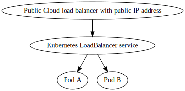
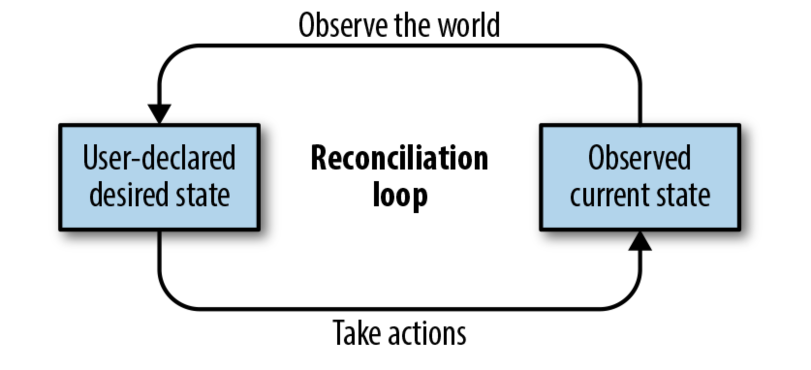

= Exposing your application to the public

In this section we will explore some of the considerations making apps available on the internet.
One of the major benefits of k8s is how it makes exposing an app very simple however the process is more nuanced
than it looks at first glance - the simplest way is not necessarily the most sensible choice long term.

== A word of warning
WARNING: A goal of Kubernetes is to provide consistent experience across multiple cloud providers and bare metal
installations. Configuring network services is an area where you will find differences in how services
are exposed. The core concepts stay the same but in order provide more advanced configuration
settings, vendor specific annotations often need to be used,

== Services
Services provide the means to access your pods both externally and internally (discussed later).
A deployment without a service will still work but will not be very useful as you would only be able
to access the Pods from within the cluster. Another problem is that Pods are ephemeral and the IP
address and DNS name will change without notice. This is where services are essential, the allow
pods within a deployment to be discovered both from inside the cluster by other pods and from external
clients such as web browsers.

=== LoadBalancer services
Previously in this talk, we utilised a a `LoadBalancer` service. This is by far the quickest way
to expose a deployment, it works by asking your cloud provider to provision a load balancer
with a public IP address that points to the internal, cluster IP of the service. Requests can be
made to the service via either the external or cluster IP, which will then be load balanced to the member Pods'
internal IP addresses.

//[graphviz, k8s-lb-service, svg]
//----
//digraph g {
//    "Public Cloud load balancer with public IP address \n[external IP]" -> "Kubernetes LoadBalancer service \n[cluster IP]";
//    "Kubernetes LoadBalancer service \n[cluster IP]" -> "Pod A"
//    "Kubernetes LoadBalancer service \n[cluster IP]" -> "Pod B"
//}
//----

`LoadBalancer` are a great choice if you have only a small number of applications deployed on your cluster,
or do not yet need fine grained control over how traffic is routed to your application. The issues to be aware
of with `LoadBalancer` services are;

* Every service will incur cost from the cloud provider to host a load balancer. These costs could quickly mount up with
a large number of apps.

* Cloud providers implement `LoadBalancer` services differently and in a bare metal cluster the service type does
not exist at all unless. Typically, annotations are used to specify cloud vendor specific configuration
such as TLS settings. These annotations will differ between cloud providers and can make it harder
to host your application in multiple cloud environments.

Our advice is start simple and consider using a `LoadBalancer` service to start with. If you find that it
doesn't scale to your needs then you probably want to look at setting up an `Ingress` to provide
a reverse proxy for your applications.

Declaratively creating a `LoadBalancer` service is as simple as this snippet:

[source,yaml]
----
apiVersion: v1
kind: Service
metadata:
  name: todo-gui-svc
spec:
  ports:
  - port: 80
    targetPort: 4200
  type: LoadBalancer
  selector:
    app: todo-gui
----

After applying the service you will see, after some time a new external IP address is allocated for the service;
`kgs todo-gui-svc --output jsonpath='{.status.loadBalancer.ingress[0].ip}'`

You can then search for the the forwarding rule and target pool
`gcloud compute forwarding-rules list --format json | jq '.[] | select(.IPAddress == "33.12.54.143") | .name'`

`gcloud compute target-pools describe af8eb99d9f64d11e9902042010a9a012 --region=europe-west2 --format=json | jq -r '{description,instances}'`
[source,json]
----
{
  "description": "{\"kubernetes.io/service-name\":\"default/todo-gui-svc\"}",
  "instances": [
    "https://www.googleapis.com/compute/v1/projects/cf-sandbox-ohughes/zones/europe-west2-a/instances/gke-devoxx-demo-default-pool-35cc49e6-1x1v",
    "https://www.googleapis.com/compute/v1/projects/cf-sandbox-ohughes/zones/europe-west2-a/instances/gke-devoxx-demo-default-pool-35cc49e6-n2lr",
    "https://www.googleapis.com/compute/v1/projects/cf-sandbox-ohughes/zones/europe-west2-a/instances/gke-devoxx-demo-default-pool-35cc49e6-w5nw"
  ]
}
----

=== A note on NodePort services
`NodePort` services are a simple way to allow internet traffic to your applications. On each of your physical (or virtual!)
k8s nodes, the desired port is opened on all the nodes. A `NodePort` is useful for quick demos but should be avoided for production workloads.
The main reasons are;
* Need to manage DNS manually if node IP changes
* Can only use ports 30000-32767 so services hard to discover
* Does not integrate with Kubernetes security and often requires firewall changes

=== What magic is actually happening behind the scenes?
As with many things in k8s, it depends! Much of the technical detail of what happens in your Kubernetes cluster can be
glossed over to a degree however we do recommend getting to grips of how services work and is it can be useful for debugging
 issues with your app. We will explain the default `iptables proxy mode`, there are also `userspace proxy mode` and `IPVS mode`.
 Today you are only likely to encounter `iptables proxy mode` but `IPVS mode` will become the default in the future as it offers
 better performance and more load balancing algorithms.

`kube-proxy` is a process that runs on every node as a pod. When a service is created, the k8s api will assign a unique virtual IP
address for the service, this is referred to as a ClusterIP.
In it's default mode `kube-proxy` will see a new service has been created and add an `iptables` rule that
captures traffic to the service ClusterIP  and redirect it to one of the pods. `kube-proxy` will also watch for any changes
to a service, such as scaling of pods, and ammend the `iptable` rules as required. It will also clean up rules when a service is deleted.

If a pod does not have a `Readiness Probes` configured and is down, the existing `iptables` rule will remain
in place and traffic will still be routed to the unhealthy pod. A `Readiness Probe` for the pod will mean
the unhealthy pod will be removed from the services backend. `kube-proxy` will see that the pod has been evicted from the service
and remove the `iptables` rule that routes traffic to it.

TIP: This process of watching for external changes and reacting to them is a very common pattern in Kubernetes components
and is known as a reconciliation loop.

== ClusterIP Services & Ingress controllers

In our experience, the most flexible way to expose your application is by using an Ingress. An Ingress is similar to a reverse proxy
or API Gateway that receives HTTP/HTTPS traffic and forwards the request to a backend service. Ingresses operate at Layer 7
so offer more intelligent routing options than regular Services that operate at network layer 4 (just uses IP and port to dispatch request)

Typically an Ingress will offer features such as
* Rules based URL routing
* Load balancing
* TLS termination
* Rewriting request URLs
* Authentication
* Add custom headers to the request

To set up an Ingress for your application, you configure an Ingress Resource. The resource is provisioned by an Ingress Controller.
Typically the resource will be a new upstream virtual host configuration, this will be familiar if you have ever configured a web server
such as Nginx or Apache httpd.

We will show how `ingress-nginx` can be used as a front end for traffic to your applications. `ingress-nginx` project is supported by the
Kubernetes project and is the component we will be using. Note this is not to be confused with `nginxinc/kubernetes-ingress`. This
is an alternative product that has commercial support available from nginx.com

At a logical level there are 3 collaborators in creating an Ingress

Most Kubernetes distributions will usually have an Ingress Controller, Amazon EKS and Google GKE both provide ingress controllers
that use their own cloud load balancer. As we are using nginx-ingress instead of a cloud specific ingress we will need to install
the Ingress Controller ourselves using `helm` . Some k8s distributions such as Rancher already provide an install of `ingress-nginx` so
no further steps required.

=== Setting up hostnames for an Ingress

==== Using a Static IP

==== Using External hostnames

=== Creating certificates for Kubernetes

=== TLS termination using ingess-nginx

=== TLS termination using a load balancer service

=== Advanced traffic routing
==== Benefits of Istio Ingress Gateway